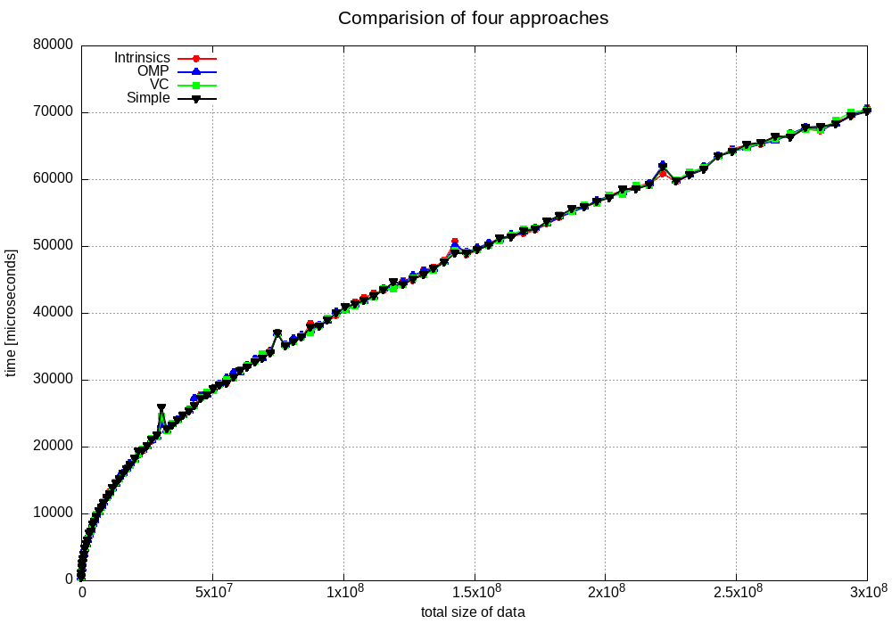

# SIMD

Repository for testing simd operations, compare different approaches.
Overall goal was to add two arrays (`A = B + C`). I used four approaches for vectorization. Also I run the programs with different array sizes.

Currently repository contains couple of things:
* `benchmark` directory. It will be described later in that document
* `intrinsics` directory. It uses intrinsics for vectorization
* `omp` directory. It uses OMP for vectorization
* `simple` directory. It uses compiler for vectorization
* `vc` directory. It uses vc library for vectorization

Each of that directories contains two versions of the program: with warm-up loop and without it. In the `intrinsics` directory you can find `intrinsics_countinuous.cpp` which will be described later in that document.

## Build
To build programs in each of the directories run
```
make DIR=dirname
```
e.g.
```
make DIR=omp
```
To build `benchmark` directory run
```
make benchmark
```

## `run_avg.sh` file

My first idea was to test different approaches with and without warm-up loop. Each program was run 100 times. You can open `run_avg.sh` script, uncomment commented code (which approach you want to test) and run it. Also uncomment which averages you want to see. 

Each program is run for arrays of sizes 100000000. There are three arrays. The have floats inside, so total size of all three arrays is 1.2 GB.

For intrinsics approach you will likely see something similar to
```
Average of ./intrinsics/intrinsics_simple.txt: 242.809524
Average of ./intrinsics/intrinsics_simple_dummy_loop.txt: 69.500000
Average of warm_up.txt: 245.514851
```

You can test it for different directories.

## Benchmark
There is also benchmark test written in the `run_benchmark.sh` file. To run benchmark tests run
```
make benchmark
./run_benchmark.sh
```
It will take a while to finish.
Test runs each approach (intrinsics, vc, omp, compiler) for different data size. In the `run_benchmark.sh` file there is a for loop which starts at 100, increments by 100 and finishes at 10000. This is size factor (lets call it `f`) passed to each program. The real size of one array inside the program is `f * 10000`. There are three arrays, so total number of data is `3 * f * 10000`.

After script will finish the plot will be created. IT should be similar to

As you can see all approaches seem to behave identically. The question is, why are there peaks at some sizes.

## intrinsics continuous
For big data size (1.2 GB) there is no way it fits in the cache. 

Since processor loads to cache more data than it needs at the time, I thought it would be a good idea to use only one big array with following layout:
```
bbbbbbbbccccccccaaaaaaaabbbbbbbbccccccccaaaaaaaabbb...
```
In that way, in the main for loop we could load to the vector 8 floats interpreted as numbers from B array, then load to the vector 8 floats interpreted as numbers from C array, add them and store result vector in the place of the array where it is interpreted as an A array. You can find implementation of that idea in the `intrinsics/intrinsics_continuous.cpp`. I thought that since cache loads more data than it needs, there will be less cache misses (when program first needs data from B, it will load also data from C, A, next B etc...).

I run `run_avg.sh` for intrinsics and get that results:
```
Average of ./intrinsics/intrinsics_simple.txt: 242.809524
Average of ./intrinsics/intrinsics_simple_dummy_loop.txt: 69.500000
Average of ./intrinsics/intrinsics_continuous.txt: 110.063636
Average of ./intrinsics/intrinsics_continuous_dummy_loop.txt: 109.786408
Average of warm_up.txt: 266.060000
```
As we can see there is big improvement with one array to what we have with simple approach (242 ms vs 110 ms). We can observe that warm-up loop doesnt affect one-array solution. But the question is, why warm-up loop helps with the simple solution and is even better than one array (3 times faster)?

I run `perf` program to check cache misses. I used following flags:
```
perf stat -e cache-references,cache-misses,L1-dcache-loads,L1-dcache-load-misses,LLC-loads,LLC-load-misses ./intrinsics/PROGRAM
```
and thats what I get:
* `intrinsics_simple`
```
Performance counter stats for './intrinsics/intrinsics_simple':

        60,285,810      cache-references                                                        (66.58%)
        40,058,872      cache-misses                     #   66.45% of all cache refs           (66.61%)
       817,410,997      L1-dcache-loads                                                         (66.68%)
        42,329,892      L1-dcache-load-misses            #    5.18% of all L1-dcache accesses   (66.72%)
         7,695,416      LLC-loads                                                               (66.73%)
         3,048,855      LLC-load-misses                  #   39.62% of all LL-cache accesses    (66.68%)

       1.485551579 seconds time elapsed

       0.929625000 seconds user
       0.554776000 seconds sys
```
* `intrinsics_simple_dummy_loop`
```
Performance counter stats for './intrinsics/intrinsics_simple_dummy_loop':

        98,533,560      cache-references                                                        (66.59%)
        65,608,207      cache-misses                     #   66.58% of all cache refs           (66.63%)
       842,601,542      L1-dcache-loads                                                         (66.70%)
        58,491,297      L1-dcache-load-misses            #    6.94% of all L1-dcache accesses   (66.70%)
         9,632,215      LLC-loads                                                               (66.70%)
         4,003,073      LLC-load-misses                  #   41.56% of all LL-cache accesses    (66.67%)

       1.503395102 seconds time elapsed

       0.959594000 seconds user
       0.536773000 seconds sys
```
* `intrinsics_continuous`
```
Performance counter stats for './intrinsics/intrinsics_continuous':

        63,026,943      cache-references                                                        (66.59%)
        48,353,848      cache-misses                     #   76.72% of all cache refs           (66.61%)
     1,303,329,443      L1-dcache-loads                                                         (66.69%)
        50,196,040      L1-dcache-load-misses            #    3.85% of all L1-dcache accesses   (66.74%)
        14,237,031      LLC-loads                                                               (66.72%)
         8,811,989      LLC-load-misses                  #   61.89% of all LL-cache accesses    (66.66%)

       1.491975532 seconds time elapsed

       0.976643000 seconds user
       0.514811000 seconds sys
```

As you can see, that all approaches has similar percentage of cache misses. one-array has the lowest percentage of L1 load misses and simple has the lowest percentage of LLC load misses.

To check if something is going on with the assembly, I deassembled that three programs. There can be found in `intrinsics` directory. But the main loop is always calculated in the same way (besides the continuous one which of course is different but quite similar).
To find that loop in each file find following labels:
* .L43 in `intrinsics_simple.asm`
* .L37 in `intrinsics_simple_dummy_loop.asm`
* .L56 in `intrinsics_continuous.asm`

So why the times are different? I don't know for now. It will be object of my further investigation.